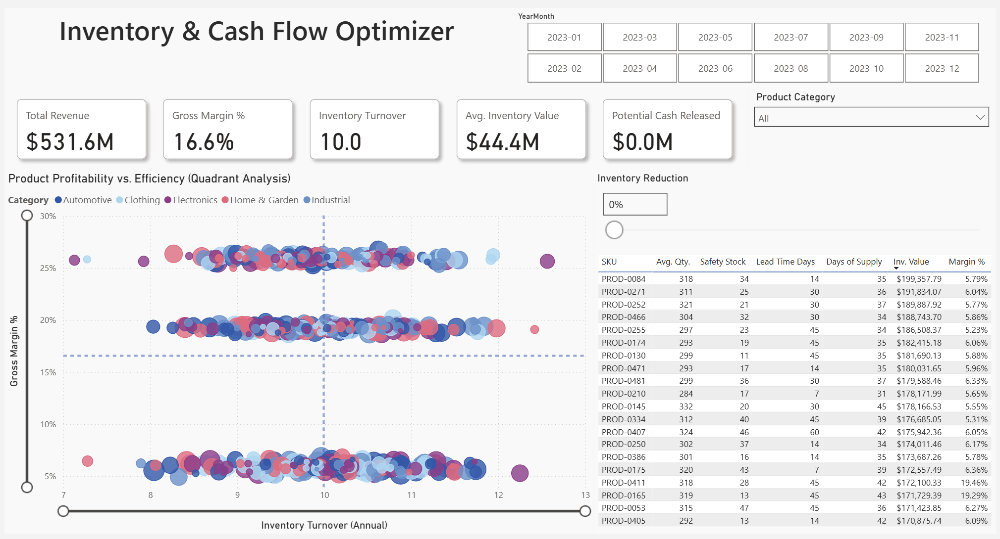

# Inventory Health & Cash Flow Optimizer 

  

> **Quick Navigation / Nawigacja:**  
> [🇬🇧 English Version](#english-version) | [🇵🇱 Polska wersja](#wersja-polska)

---

### 1. Project Goal & Business Problem
The company generated high revenue but struggled with low liquidity. The primary goal of this project was to identify capital frozen in inventory and optimize Cash Flow.
The report enables management to:
*   Precisely identify **Overstock** and **Dead Stock**.
*   Simulate financial benefits (Cash Release) resulting from inventory reduction.
*   Analyze product profitability vs. efficiency (Quadrant Analysis).

### 2. Data Source
The dataset is synthetic, generated via Python scripts to simulate real-world **ERP (e.g., SAP)** and **WMS** exports.
*   **Volume:** Full operational year (2023), ~200,000 transaction rows.
*   **Complexity:** The data includes intentional "dirty data" scenarios typical for analytics:
    *   Inconsistent date and currency formats.
    *   **Matrix structure (pivoted)** in inventory reports requiring transformation.
    *   Missing SKU attributes and master data gaps.
*   **Files:**
    *   `01_Inventory_Levels.xlsx`: Weekly snapshots (North/South warehouses).
    *   `02_Product_Master.csv`: Logistics parameters (Lead Time, Safety Stock).
    *   `03_Sales_Transactions.csv`: Daily sales register.

### 3. Data Architecture (Star Schema)
The model follows the **Star Schema** methodology to ensure performance and intuitive navigation.
*   **Fact Tables:**
    *   `Fact_Sales`: Daily sales transactions (Grain: Transaction/Day).
    *   `Fact_Inventory`: Weekly inventory snapshots (Grain: SKU/Warehouse/Week).
*   **Dimension Tables:**
    *   `Dim_Products`: Central product master (Lead Time, Unit Cost). Acts as a 1:* filter for both fact tables.
    *   `Dim_Date`: Conformed Dimension allowing synchronization of Sales (Daily) and Inventory (Weekly) analysis.

### 4. ETL Process (Power Query / M)
*   **Unpivot:** Transformed matrix inventory reports into a tabular format for proper time-series analysis.
*   **Data Cleaning:** Standardized SKU codes, fixed data types, and consolidated data from multiple warehouse sources (Append).
*   **Optimization:** Disabled loading of staging tables to the model to reduce memory footprint.

### 5. DAX & Business Logic
[Click here to view the full DAX documentation](DAX_Measures.md)

Key modeling techniques used:
*   **Semi-Additive Measures:** Used `AVERAGEX` and `VALUES` for Inventory Value to prevent incorrect summation of stock levels over time.
*   **Annualization:** Implemented dynamic factors for **Inventory Turnover** to allow fair comparison between partial periods (e.g., Month vs. Year).
*   **Base Measures:** Created foundational measures to ensure correct calculation of Margin and COGS at the row level.

### 6. Dashboard Features
*   **Executive Summary:** Top 5 KPIs (Revenue, Margin %, Turnover, Inventory Value, Potential Cash Release).
*   **Quadrant Analysis:** Scatter plot (Margin % vs. Turnover) to segment products into "Cash Cows", "Bleeders", and "Dead Stock".
*   **What-If Simulation:** Interactive parameter to estimate cash release potential based on inventory reduction targets.
*   **Operational Drill-down:** Detailed table highlighting SKUs with **High Days of Supply** vs. **Low Lead Time**.

### 7. Business Insights & Recommendations
Preliminary analysis highlights key areas for optimization:
1.  **Overstocking Risk:** Identified products (e.g., `PROD-0185`) with excessive coverage (**50 Days of Supply**) despite short replenishment cycles (**Lead Time: 7 days**).
    *   *Recommendation:* Reduce safety stock for these SKUs to release immediate cash.
2.  **Profitability Risk:** A cluster of products shows high turnover (8-12x) but critical margins (<6%).
    *   *Recommendation:* Focus on renegotiating supplier costs (COGS) rather than liquidation, as demand is strong.
3.  **Cash Release Potential:** A conservative 10% reduction in inventory for low-performing SKUs could release approx. **$400k** in working capital.

---

## 🇵🇱 Wersja Polska

### 1. Cel projektu i problem biznesowy
Przedsiębiorstwo generowało wysokie przychody, ale borykało się z niską płynnością finansową. Głównym celem projektu było zidentyfikowanie kapitału zamrożonego w zapasach oraz optymalizacja przepływów pieniężnych (Cash Flow).
Raport umożliwia kadrze zarządzającej:
*   Precyzyjną identyfikację produktów nierotujących (**Dead Stock**) oraz nadmiernych zapasów (**Overstock**).
*   Symulację korzyści finansowych wynikających z redukcji stanów magazynowych.

### 2. Źródło i charakterystyka danych
Dane są syntetyczne, wygenerowane w Pythonie, aby symulować realne wyciągi z systemów **ERP (np. SAP)** oraz **WMS**.
*   **Wolumen:** Pełny rok operacyjny (2023), >200 000 wierszy.
*   **Złożoność:** Dane zawierają celowe błędy:
    *   Niespójne formaty dat i walut.
    *   **Struktura macierzowa (pivot)** w plikach magazynowych wymagająca transformacji.
    *   Braki w słownikach produktowych.

### 3. Architektura Danych (Star Schema)
Model zaprojektowano w architekturze **Schematu Gwiazdy** (Star Schema).
*   **Tabele Faktów:**
    *   `Fact_Sales`: Transakcje sprzedaży (Dziennie).
    *   `Fact_Inventory`: Snapshoty stanów magazynowych (Tygodniowo).
*   **Tabele Wymiarów:**
    *   `Dim_Products`: Słownik produktów (Lead Time, Safety Stock). Relacja 1:* z tabelami faktów.
    *   `Dim_Date`: Wspólny wymiar czasu (Conformed Dimension) integrujący sprzedaż i stany magazynowe.

### 4. Proces ETL (Power Query)
*   **Unpivot:** Zamiana dat z kolumn na wiersze, umożliwiająca analizę Time Intelligence.
*   **Data Cleaning:** Standaryzacja SKU, naprawa typów danych, konsolidacja plików (Append).
*   **Optymalizacja:** Wyłączenie ładowania tabel technicznych (staging) do modelu.

### 5. DAX
[Kliknij tutaj, aby zobaczyć dokumentację miar DAX](DAX_Measures.md)

Zastosowane techniki:
*   **Średnie stany magazynowe:** Użycie `AVERAGEX` i `VALUES` zapobiega błędnemu sumowaniu stanów w czasie (Semi-additive measures).
*   **Annualizacja:** Dynamiczne przeliczanie rotacji (Inventory Turnover) dla niepełnych okresów.
*   **Miary pomocnicze:** Separacja logiki biznesowej od tabel źródłowych.

### 6. Kluczowe Funkcje Dashboardu
*   **Executive Summary:** Główne KPI (Przychód, Marża, Rotacja, Wartość Magazynu, Potencjał Uwolnienia Gotówki).
*   **Quadrant Analysis:** Wykres punktowy (Marża vs Rotacja) do segmentacji asortymentu.
*   **Symulacja What-If:** Suwak pozwalający oszacować wpływ redukcji zapasów na Cash Flow.
*   **Tabela Operacyjna:** Lista SKU wymagających interwencji (analiza Days of Supply vs Lead Time).

### 7. Wnioski Biznesowe
Wstępna analiza wykazała kluczowe obszary do optymalizacji:
1.  **Problem Overstockingu:** Wykryto produkty (np. `PROD-0185`), które posiadają zapas na **50 dni**, mimo że czas dostawy wynosi tylko **7 dni**.
    *   *Rekomendacja:* Redukcja Safety Stock dla tych pozycji pozwoli natychmiast uwolnić gotówkę.
2.  **Niska Rentowność:** Grupa produktów o wysokiej rotacji (8-12x), ale marży poniżej 6%.
    *   *Rekomendacja:* Renegocjacja cen zakupu (COGS), zamiast wyprzedaży, która pogłębiłaby niską marżę.
3.  **Potencjał Cash Flow:** Symulacja wykazuje, że 10% redukcja zapasów w grupach nierotujących może uwolnić ok. **$400k** środków obrotowych.
